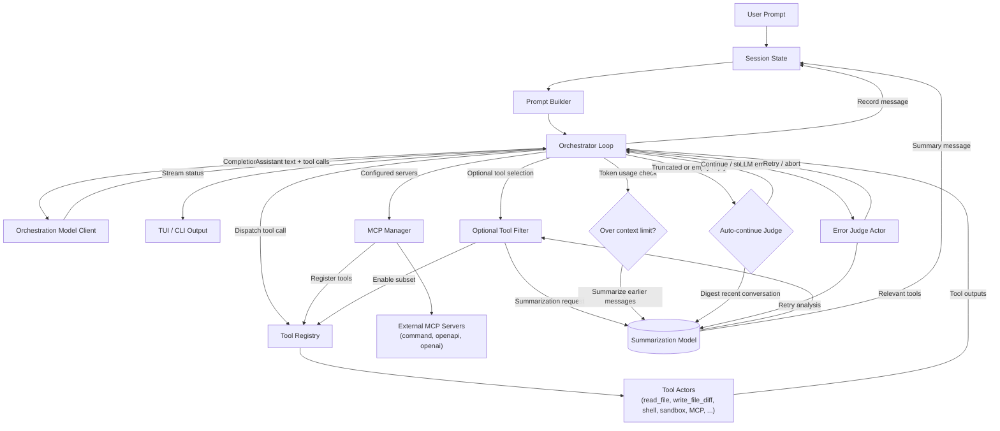

# StatCode AI

> This project is actively in initial development. Use at your own risk!

**statcode-ai** is a TUI that generates code from prompts using LLMs.

## Features

- Multiple providers supported
- Native search engine support
- Golang WASM wasip1 sandbox (compiled with TinyGo)
- Auto-continue for long-running sessions
- Auto-compaction during generation for longer sessions
- Two separate LLM models for orchestration and summarization

## TODO

- [x] Infinite text loop detection (Gemini loves to repeat itself)
- [ ] Better authorization UI
- [ ] More e2e tests using other programming languages than Go
- [ ] Custom system prompt
- [ ] System prompt optimized for current codebase
- [ ] Better `/init` command for generating AGENTS.md
- [ ] Fix write diff
- [ ] [agent-client-protocol](https://github.com/agentclientprotocol/agent-client-protocol) for better editor integration
- [ ] Better UI experience for `parallel_tools` call
- [ ] Encourage LLMs to use the `parallel_tools` call (only gemini seems to do this)
- [ ] Limit the auto-continue judge so it doesn't get stuck in a loop
- [ ] Unify the model/provider detection (context window size/model specific workarounds)
- [ ] Fix auto compaction (seems to be really broken)
- [ ] Get rid of magic literals in the codebase
- [ ] General UI improvements around tool calls
- [x] Todo task are not showing up in the UI
- [x] On configured web search, add text to the system prompt for more up-to-date results
- [ ] Speed up startup time
- [x] Support user configured mcp's with auto-selecting only relevant ones
- [ ] Only cache directory listings in working directory
- [ ] Implement persistent authorization on a per-project basis
- [ ] Unify tui command programming
- [ ] Filter models by provider in models menu
- [ ] Fix models menu (weird scrolling behavior, layout issues)
- [ ] On configuring the first provider, choose a default model
- [ ] Fix mistral model performance
- [ ] Use token usage response from provider if available
- [ ] Output credit usage per session
- [ ] Weird kimi k2 context window problems

## Goals

- Universal codebase LLM editing experience (cli, tui, code editor, web browser)
- Compatible with many LLM providers

### Maybes

- [ ] Implement a small bash parser so bash on Windows works?
- [ ] Support for easy containerization, e.g. devcontainer?

## Agentic Workflow

The orchestrator coordinates LLM calls, tool execution, and adaptive control loops. The diagram below shows how the orchestration model, tool registry, summarization model, and auto-continue judge work together.



## Providers

Supported providers:

- OpenAI
- Anthropic
- Google Gemini
- Mistral
- OpenRouter
- Cerebras
- Ollama
- OpenAI-compatible

Recommended are `Cerebras` with `zai-glm-4.6` for the orchestration model and
`gpt-5-nano` or `gemini-2.5-flash` for the summarization model.

### Provider Rate Limits

If you frequently hit HTTP 429 errors, add a `rate_limit` block to a provider entry in `~/.config/statcode-ai/providers.json` to slow requests:

```json
{
  "providers": {
    "anthropic": {
      "name": "anthropic",
      "api_key": "sk-live...",
      "models": [/* ... */],
      "rate_limit": {
        "requests_per_minute": 30,
        "min_interval_ms": 2000,
        "tokens_per_minute": 10000
      }
    }
  }
}
```

Both fields are optional; the slowest effective interval wins (e.g., `requests_per_minute: 30` becomes a 2s delay, and `min_interval_ms` adds a fixed delay between requests).
Add `tokens_per_minute` when you need to throttle large tool outputs being sent back through the LLM.
## Build and Run

### Prerequisites

- Go 1.21 or later

### Building

```bash
# Build the binary
go build -o statcode-ai ./cmd/statcode-ai
```

### Running

```bash
# Run in TUI mode (interactive)
./statcode-ai

# Run in CLI mode (single-shot)
./statcode-ai "your prompt here"

# Install globally
go install ./cmd/statcode-ai
```

### Testing

```bash
# Run simple tests
go test ./... -short
```

