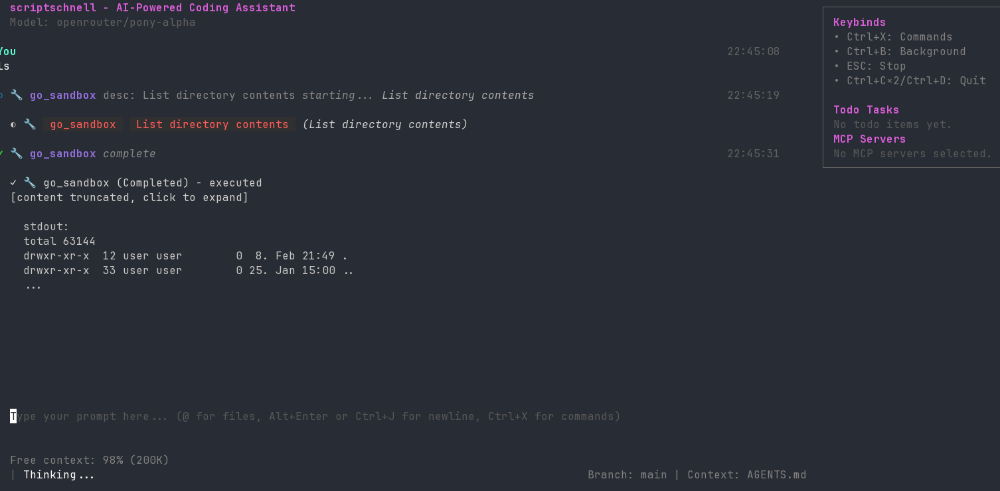
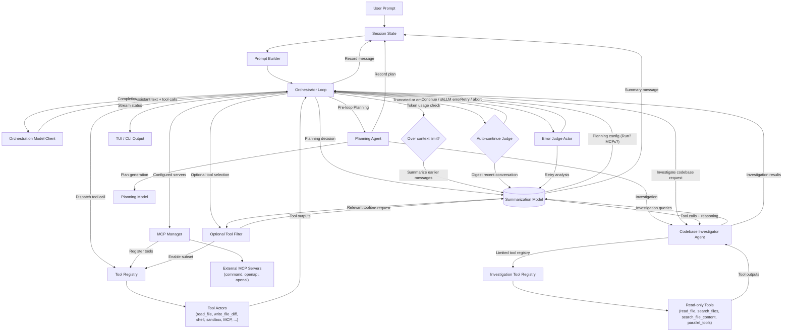

# scriptschnell

> This project is actively in initial development. Use at your own risk!

**scriptschnell** is a TUI that generates code from prompts using LLMs.

On first run, it will download tinygo (if not in PATH).

## Features

- Multiple providers supported
- Native search engine support
- Golang WASM sandbox (compiled with TinyGo, which is downloaded on startup)
- Auto-continue for long-running sessions
- Auto-compaction during generation for longer sessions
- Separate LLM models:
    - Orchestrator: writes the actual code
    - Summarization: summarizes and makes *small* choices
    - Planning: Plans the next steps
- Read only contexts like external documentation, library sources, etc.
- Experimental agent client protocol support

## TODO

- [x] Infinite text loop detection (Gemini loves to repeat itself)
- [ ] Better authorization UI
- [ ] More e2e tests using other programming languages than Go
- [ ] Custom system prompt
- [x] System prompt optimized for current codebase
- [x] Better `/init` command for generating AGENTS.md
- [x] Fix write diff
- [x] [agent-client-protocol](https://github.com/agentclientprotocol/agent-client-protocol) for better editor integration
- [ ] Better UI experience for `parallel_tools` call
- [ ] Encourage LLMs to use the `parallel_tools` call (only gemini seems to do this)
- [x] Limit the auto-continue judge so it doesn't get stuck in a loop
- [x] Unify the model/provider detection (context window size/model specific workarounds)
- [ ] Fix auto compaction
- [ ] Get rid of magic literals in the codebase
- [ ] General UI improvements around tool calls
- [x] Todo task are not showing up in the UI
- [x] On configured web search, add text to the system prompt for more up-to-date results
- [ ] Speed up startup time
- [x] Support user configured mcp's with auto-selecting only relevant ones
- [ ] Only cache directory listings in working directory
- [ ] Implement persistent authorization on a per-project basis
- [ ] Unify tui command programming
- [ ] Filter models by provider in models menu
- [x] Fix models menu (weird scrolling behavior, layout issues)
- [ ] On configuring the first provider, choose a default model
- [ ] Fix mistral model performance
- [x] Use token usage response from provider if available
- [ ] Output credit usage per session (currently just openrouter, implement cost estimation)
- [x] Weird kimi k2 context window problems
- [x] Deadlock problem when model used invalid tool call (the session cannot continue)
- [x] Multi session support in the tui
- [ ] Anthropic Prompt Caching
- [ ] Auto session saving
- [ ] Server mode
- [ ] Split config in runtime config and user config
- [ ] Fix agent client protocol output (zed editor)
- [ ] Implement proper shell sandbox
- [ ] Continue implementing the eval tooling
- [ ] After auto compaction tell the model that this happend and it should
      verify that requested changes were fully implemented, if thinks that these were
      fully implemented

## Goals

- Universal codebase LLM editing experience (cli, tui, code editor, web browser)
- Compatible with many LLM providers
- Promoting usage of open weight models

### Maybes

- [ ] Implement a small bash parser so bash on Windows works?
- [ ] Support for easy containerization, e.g. devcontainer?
- [ ] Expose external MCP servers as OpenAPI endpoints in golang sandbox?

## Agentic Workflow

The orchestrator coordinates LLM calls, tool execution, and adaptive control loops. The diagram below shows how the orchestration model, tool registry, summarization model, and auto-continue judge work together.

## Providers

Supported providers:

- OpenAI
- Anthropic
- Google Gemini
- Mistral
- OpenRouter
- Cerebras
- Ollama
- OpenAI-compatible

Recommended since 2025-12-10:
- Orchestrator model: Google Gemini 3 Pro or zai-glm-4.6
- Summarization model: Mistral Codestral 2508
- Planning model: Claude Opus 4.5
