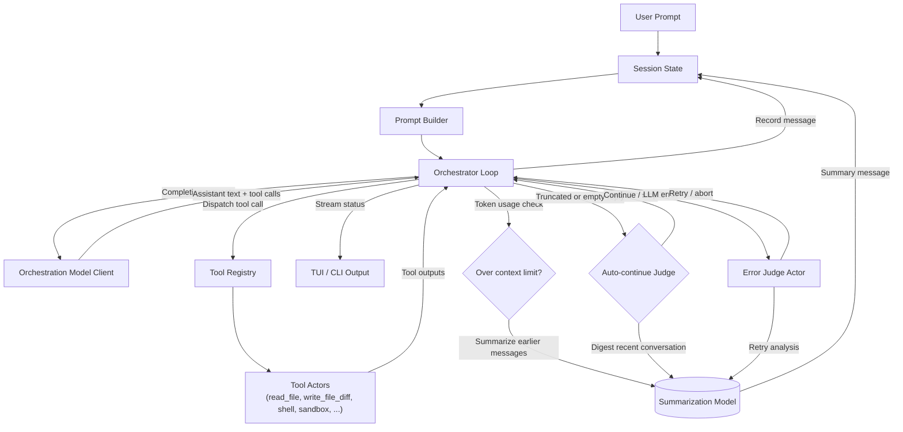

# StatCode AI

**statcode-ai** is a TUI that generates code from prompts using LLMs.

## Features

- Multiple providers supported
- Native search engine support
- Golang WASM wasip1 sandbox (compiled with TinyGo)
- Auto-continue for long-running sessions
- Auto-compaction during generation for longer sessions
- Two separate LLM models for orchestration and summarization

## TODO

- [ ] Infinite text loop detection (Gemini loves to repeat itself)
- [ ] Better authorization UI
- [ ] More e2e tests using other programming languages than Go
- [ ] Custom system prompt
- [ ] System prompt optimized for current codebase
- [ ] Better `/init` command for generating AGENTS.md
- [ ] Fix write diff
- [ ] [agent-client-protocol](https://github.com/agentclientprotocol/agent-client-protocol) for better editor integration
- [ ] Better UI experience for `parallel_tools` call
- [ ] Encourage LLMs to use the `parallel_tools` call (only gemini seems to do this)
- [ ] Limit the auto-continue judge so it doesn't get stuck in a loop
- [ ] Unify the model/provider detection (context window size/model specific workarounds)
- [ ] Fix auto compaction (seems to be really broken)
- [ ] Get rid of magic literals in the codebase

**Implementation Details**: See [internal/orchestrator/orchestrator.go:1069-1151](internal/orchestrator/orchestrator.go#L1069-L1151) for the `executeToolWithHeartbeat` and `executeToolWithApprovalAndHeartbeat` methods.

### Maybes

- [ ] Implement a small bash parser so bash on Windows works?
- [ ] Support for easy containerization, e.g. devcontainer?

## Agentic Workflow

The orchestrator coordinates LLM calls, tool execution, and adaptive control loops. The diagram below shows how the orchestration model, tool registry, summarization model, and auto-continue judge work together.

## Providers

Supported providers:

- OpenAI
- Anthropic
- Google Gemini
- Mistral
- OpenRouter
- Cerebras
- Ollama
- OpenAI-compatible

Recommended are `Cerebras` with `qwen-3-coder-480b` model (it will be interesting
how `zai-glm-4.6` performs) for the orchestration model and `gpt-5-nano` for the
summarization model.